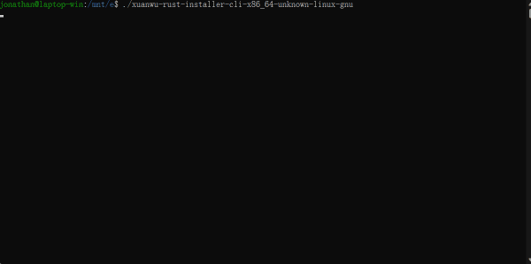

# R.I.M (Rust Installation Manager)

An interactive program to install & manage Rust toolchain and third-party tools, supports graphical user interface (**GUI**) and a basic commandline interface (**CLI**).

## Demo

### GUI


### CLI



## How does it work?

### Fundamental

This program takes one configuration file [`toolset-manifest`](./resources/toolset_manifest.toml), loads a list of tools from it,
then takes advantage of [`rustup`](https://github.com/rust-lang/rustup) to install Rust toolchain, and uses various method to install different tools (*supporting `vscode`, `MSVC buildtools`, `MinGW` etc, conditions and limitations applied, the details are in the [Support](#support) section).

After installation, users will have a `toolkit`, which is a combination of Rust toolchain and (**maybe**) a collection of tools if user choose to install it.
The `toolkit` can be upgraded/downgraded as well. Which requires another configuration file,
called [`distribution-manifest`](./resources/mock/dist/distribution-manifest.toml), this is typically stored in a server, telling the program what `toolkit` is available to be installed.

### Installer and Manager

The functions of this program are splitted into two parts: `installer` and `manager`, similar to `rustup`'s `rustup-init` and `rustup`.

- `installer` does the setup work, which initializes the local environment, that includes:
  - creating the installation root
  - setup `CARGO_HOME`, `RUSTUP_HOME`, `RUSTUP_DIST_SERVER`, `RUSTUP_UPDATE_ROOT` environment variables automatically. (Note if you already have these configured, those might get overrided).</br>
After env setup, it will guide you through installing Rust `toolkit`.
- `manager`, well... it manages stuffs, such as `updating` and `uninstalling` toolkit. (`components managing` is on the way)

> Unlike `rustup`, this program can be used to manage additional set of tools instead of the Rust toolchain.
> Additionally, this program installs `rustup` by default, so you can continue using `rustup` with no problems.

## Build

### Prerequisite

To build the GUI version, you'll need `NodeJs` and `pnpm` installed.
You also need to install the `tauri-cli` (v1) binary, which you can install by:

- run `cargo install tauri-cli --version '^1'`
- download the built binary from their [github release](https://github.com/tauri-apps/tauri/releases/tag/tauri-cli-v1.6.3), then extract and put it into your `<CARGO_HOME>/.cargo/bin` folder

> Note: `tauri-cli v2` does not work, it is incompatible with `tauri v1` project structure, which this program uses.

### Release

It is recommanded to use `cargo dev dist` command for:

- GUI release: `cargo dev dist --gui`
- CLI release: `cargo dev dist --cli`
- Both above: `cargo dev dist`

The built artifacts will be stored inside of `./dist/<TARGET>/`.

> `dev release` works by building the release binary then rename it with the `vendor_en` field in [`locales/en.json`](./locales/en.json). Then collect the local packages under `resources/packages` folder, which can be gathered from Web using *`cargo dev vendor`, then use the packages to create an offline installer. 

*(check [`rim-dev's readme`](./rim_dev/README.md) for more details).

But if you just want to try the app or you only need the , just use:
- `cargo build --release` to build the CLI version (binary name: rim-cli)
- `cargo tauri build -b none` to build the GUI version (binary name: rim-gui)

## Usage

> Only `CLI` mode is listed, for `GUI` usages, checkout [this page](https://xuanwu.beta.atomgit.com/guide/) for details.
>
> Currently, GUI mode only supports **Chinese**, the English support and its usage doc will be available soon.

### Installer mode (CLI)

```console
Usage: rim-cli [OPTIONS]

Options:
  -l, --lang <LANG>             Specify another language to display [possible values: cn, en]
      --prefix <PATH>           Set another path to install Rust
      --manifest <PATH or URL>  Specify a path or url of manifest file that contains package source and various configurations
  -h, --help                    Print help
  -V, --version                 Print version
```

#### Examples

1. Set a default directory for installation:

    ```bash
    ./rim-cli --prefix path/to/dir
    ```

2. Install by loading a custom manifest (template: [`toolset_manifest.toml`](./resources/toolset_manifest.toml)):

    ```bash
    ./rim-cli --manifest path/to/your/toolset-manifest.toml
    ```

### Manager mode (CLI)

> Manager mode can be activated by:
>
> 1. Renaming the binary to one that contains `manager`, such as `manager-cli`
> 2. Having a `MODE` environment variable set to `manager` before running the program, such as running `export MODE='manager'` in Unix systems.
>
> NOTE: **Manager will be automatically deployed after installation, and must be run inside of the installation directory to avoid crash**

```console
Usage: MODE='manager' rim-cli.exe [OPTIONS] [COMMAND]

Commands:
  update     Update toolkit and/or this installation manager
  uninstall  Uninstall individual components or everything
  try-it     A subcommand to create a new Rust project template and let you start coding with it
  help       Print this message or the help of the given subcommand(s)

Options:
  -l, --lang <LANG>  Specify another language to display [possible values: cn, en]
  -h, --help         Print help
  -V, --version      Print version
```

#### Examples

1. uninstall all:

```bash
./manager uninstall
```

2. update self and toolkit:

```bash
./manager update
```

3. update toolkit only:

```bash
./manager update --toolkit-only
```

1. Export a pre-configured example project:

```bash
./manager try-it -p /path/to/create/project
```

## Support

This program support installing packages in various format, that you may put into a [`toolset-manifest`](./resources/toolset_manifest.toml) and pass an `--manifest path/to/your/` when executing the CLI app to have an option to install them.

Currently, the following package formats are supported:

1. Binaries - (with extension `.exe` on Windows, and no extension on Linux)
2. VS-Code plugins - (`.vsix` files)
3. *Compressed files - (with extension `.gz`, `.xz`, `.7z`, `.zip`)

For compressed files, the program will first try to decompress it into a temporary path, then identify the structures within, which could boil down to this two kinds:

1. Directory with `bin/` folder
2. Plain directory

Both will be placed under `<InstallationRoot>/tools` folder, but if the directory has a `bin/` folder, its path will be added to user's `PATH` variable additionally.

## Known problems

1. There's a bug related to the WebKitGTK on some linux distro, which causing the GUI program showing blank upon starting.
  This issue can be bypassed after setting the environment variable `WEBKIT_DISABLE_COMPOSITING_MODE` to `1`:

    ```bash
    export WEBKIT_DISABLE_COMPOSITING_MODE=1
    ```
